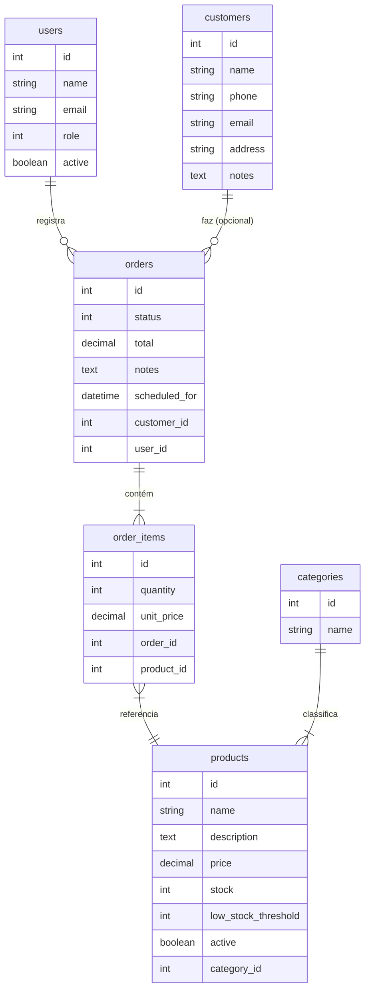

# CaixaFlow — Arquitetura

## Stack

| Componente | Escolha | Versão alvo |
|---|---|---|
| Framework | Ruby on Rails | 8.0 |
| Banco | PostgreSQL | 16 |
| Auth | Devise | 4.x |
| Busca/filtro | Ransack | 4.x |
| Paginação | Kaminari | 1.x |
| Jobs | Sidekiq + sidekiq-cron | 7.x |
| Filas | Redis | 7 |
| Imagens | Active Storage (embutido) | — |
| Testes | RSpec + FactoryBot | — |
| Assets | Importmap + Propshaft | Rails 8 padrão |
| CSS | Puro (Grid + Flexbox) | — |

---

## Modelo de dados



---

## Estrutura de pastas

```
caixaflow/
├── app/
│   ├── controllers/
│   │   ├── admin/
│   │   │   ├── base_controller.rb
│   │   │   ├── dashboard_controller.rb
│   │   │   └── users_controller.rb
│   │   ├── application_controller.rb
│   │   ├── categories_controller.rb
│   │   ├── customers_controller.rb
│   │   ├── orders_controller.rb
│   │   └── products_controller.rb
│   ├── javascript/
│   │   ├── application.js
│   │   ├── order_form.js
│   │   └── image_preview.js
│   ├── jobs/
│   │   ├── order_ready_mail_job.rb
│   │   ├── daily_sales_report_job.rb
│   │   └── low_stock_alert_job.rb
│   ├── mailers/
│   │   ├── application_mailer.rb
│   │   ├── order_mailer.rb
│   │   └── report_mailer.rb
│   ├── models/
│   │   ├── category.rb
│   │   ├── customer.rb
│   │   ├── order.rb
│   │   ├── order_item.rb
│   │   ├── product.rb
│   │   └── user.rb
│   ├── services/
│   │   ├── order_total_calculator.rb
│   │   └── stock_manager.rb
│   └── views/
│       ├── layouts/
│       ├── admin/
│       ├── categories/
│       ├── customers/
│       ├── orders/
│       └── products/
├── config/
│   ├── routes.rb
│   └── sidekiq.yml
├── db/
│   ├── migrate/
│   └── seeds.rb
├── spec/
│   ├── factories/
│   ├── jobs/
│   ├── models/
│   ├── requests/
│   └── services/
├── docs/
│   ├── requisitos.md
│   ├── arquitetura.md
│   └── classes.md
├── Dockerfile
├── docker-compose.yml
├── docker-compose.prod.yml
├── .env.example
└── Erros.md
```

---

## Rotas

```ruby
devise_for :users

namespace :admin do
  root to: "dashboard#index"
  resources :users
end

resources :categories
resources :customers, only: [:index, :show, :new, :create, :edit, :update]
resources :products
resources :orders do
  member { patch :update_status }
end

root to: "orders#index"
```

---

## Decisões técnicas

| Decisão | Motivo |
|---|---|
| `unit_price` em `order_items` | Snapshot do preço pago; imune a alterações futuras do produto |
| Enum como integer no banco | Performance + Rails enum nativo sem gem extra |
| `Admin::BaseController` | Centraliza `before_action :require_admin` — DRY + SRP |
| Services para negócio | Controller só orquestra; lógica isolada e testável |
| Importmap sem Node | Rails 8 nativo — sem pipeline de build para JS simples |
| `scheduled_for` em orders | Suporte a encomendas com data futura |
| Cliente opcional no pedido | Venda de balcão não deve exigir cadastro |
